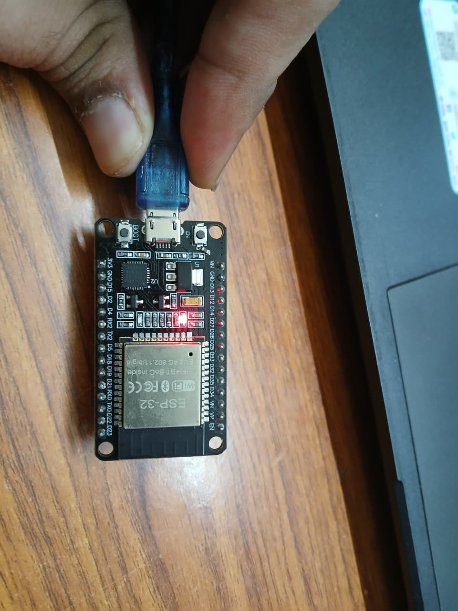
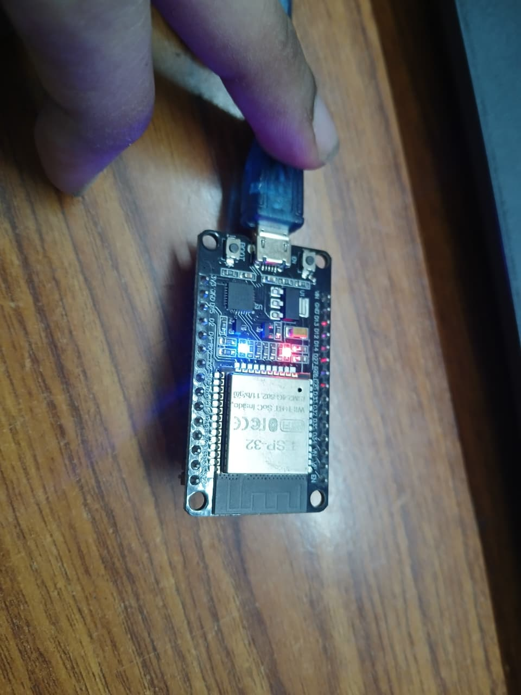
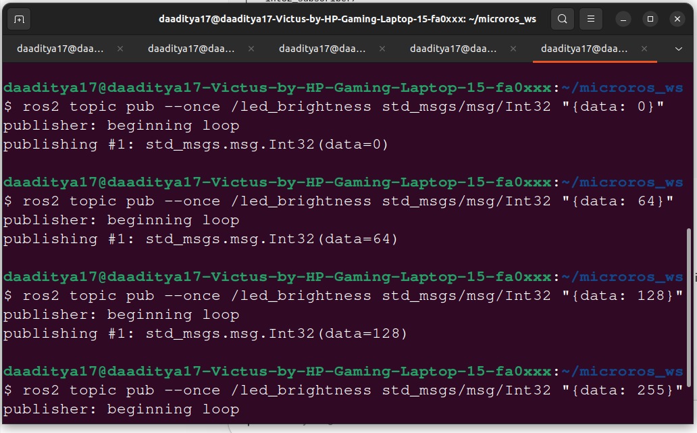

# PWM LED Control

> Control the brightness of the ESP32 onboard LED using PWM, driven by a ROS 2 `Int32` topic. Send a value 0–255 from the Pi and the LED brightness changes in real time.

---

## What This Module Does

This module demonstrates **real hardware control** through micro-ROS. The ESP32:

1. Subscribes to topic `/led_brightness` (type `std_msgs/Int32`)
2. Maps the received value (0–255) directly to the LEDC PWM duty cycle
3. The onboard LED (GPIO 2) changes brightness accordingly

```
Raspberry Pi (ROS 2)                       ESP32 Hardware
────────────────────                       ──────────────
ros2 topic pub /led_brightness             LEDC Timer 0
  std_msgs/msg/Int32 "{data: 200}" ──────► GPIO 2 (PWM)
                                                │
                                           LED brightness ∝ data/255
```

---

## PWM Configuration

| Parameter | Value | Description |
|-----------|-------|-------------|
| `LED_PIN` | `GPIO 2` | Onboard LED on most ESP32 boards |
| `LEDC_TIMER` | `LEDC_TIMER_0` | Hardware PWM timer |
| `LEDC_MODE` | `LEDC_HIGH_SPEED_MODE` | High-speed LEDC mode |
| `LEDC_CHANNEL` | `LEDC_CHANNEL_0` | PWM output channel |
| `LEDC_DUTY_RES` | `LEDC_TIMER_8_BIT` | 8-bit resolution → 0–255 |
| `LEDC_FREQUENCY` | `5000 Hz` | PWM carrier frequency |

---

## Source Code: `app.c`

```c
#include <rcl/rcl.h>
#include <rcl/error_handling.h>
#include <rclc/rclc.h>
#include <rclc/executor.h>

#include <std_msgs/msg/int32.h>

#include <stdio.h>

#ifdef ESP_PLATFORM
#include "freertos/FreeRTOS.h"
#include "freertos/task.h"
#include "driver/ledc.h"      // ESP-IDF LEDC PWM driver
#endif

#include <unistd.h>

#define RCCHECK(fn) { \
    rcl_ret_t temp_rc = fn; \
    if((temp_rc != RCL_RET_OK)) { \
        printf("Failed status on line %d: %d. Aborting.\n", \
               __LINE__, (int)temp_rc); \
        vTaskDelete(NULL); \
    } \
}

#define RCSOFTCHECK(fn) { \
    rcl_ret_t temp_rc = fn; \
    if((temp_rc != RCL_RET_OK)) { \
        printf("Failed status on line %d: %d. Continuing.\n", \
               __LINE__, (int)temp_rc); \
    } \
}

// ── Hardware definitions ──────────────────────────────────────────────────
#define LED_PIN         2

#define LEDC_TIMER      LEDC_TIMER_0
#define LEDC_MODE       LEDC_HIGH_SPEED_MODE
#define LEDC_CHANNEL    LEDC_CHANNEL_0
#define LEDC_DUTY_RES   LEDC_TIMER_8_BIT    // 8-bit = 0 to 255
#define LEDC_FREQUENCY  5000                 // 5 kHz PWM

rcl_subscription_t subscriber;
std_msgs__msg__Int32 msg;

// ── PWM Initialization ────────────────────────────────────────────────────
void ledc_init(void)
{
    // Configure timer
    ledc_timer_config_t timer_conf = {
        .speed_mode      = LEDC_MODE,
        .timer_num       = LEDC_TIMER,
        .duty_resolution = LEDC_DUTY_RES,
        .freq_hz         = LEDC_FREQUENCY,
        .clk_cfg         = LEDC_AUTO_CLK
    };
    ledc_timer_config(&timer_conf);

    // Configure channel (attach to GPIO)
    ledc_channel_config_t channel_conf = {
        .gpio_num   = LED_PIN,
        .speed_mode = LEDC_MODE,
        .channel    = LEDC_CHANNEL,
        .timer_sel  = LEDC_TIMER,
        .duty       = 0,
        .hpoint     = 0
    };
    ledc_channel_config(&channel_conf);
}

// ── Subscription callback ─────────────────────────────────────────────────
void subscription_callback(const void * msgin)
{
    const std_msgs__msg__Int32 * msg =
        (const std_msgs__msg__Int32 *)msgin;

    int brightness = (int)msg->data;

    // Clamp to valid 8-bit range
    if (brightness < 0)   brightness = 0;
    if (brightness > 255) brightness = 255;

    printf("LED brightness set to: %d\n", brightness);

    // Apply PWM duty cycle
    ledc_set_duty(LEDC_MODE, LEDC_CHANNEL, (uint32_t)brightness);
    ledc_update_duty(LEDC_MODE, LEDC_CHANNEL);
}

// ── micro-ROS task ────────────────────────────────────────────────────────
void micro_ros_task(void * arg)
{
    // Initialize PWM hardware first
    ledc_init();

    rcl_allocator_t allocator = rcl_get_default_allocator();
    rclc_support_t  support;

    RCCHECK(rclc_support_init(&support, 0, NULL, &allocator));

    rcl_node_t node;
    RCCHECK(rclc_node_init_default(&node, "pwm_led_node", "", &support));

    RCCHECK(rclc_subscription_init_default(
        &subscriber,
        &node,
        ROSIDL_GET_MSG_TYPE_SUPPORT(std_msgs, msg, Int32),
        "led_brightness"));

    rclc_executor_t executor;
    RCCHECK(rclc_executor_init(&executor, &support.context, 1, &allocator));
    RCCHECK(rclc_executor_add_subscription(
        &executor, &subscriber, &msg, &subscription_callback, ON_NEW_DATA));

    while (1) {
        rclc_executor_spin_some(&executor, RCL_MS_TO_NS(100));
        usleep(100000);
    }
}

void app_main(void)
{
    xTaskCreate(micro_ros_task, "micro_ros_task", 16000, NULL, 5, NULL);
}
```

---

## Build & Flash

```bash
# Source ESP-IDF
. $HOME/esp/esp-idf/export.sh

# Copy app.c to project
cp path/to/PWM_LED_Control/app.c main/app.c

# Build and flash
idf.py build
idf.py -p /dev/ttyUSB0 flash
idf.py -p /dev/ttyUSB0 monitor
```

---

## Control LED from ROS 2

**Start Agent (Terminal 1):**
```bash
sudo docker exec -it ros2_humble bash
source /opt/ros/humble/setup.bash
ros2 run micro_ros_agent micro_ros_agent serial --dev /dev/ttyUSB0
```

**Send brightness commands (Terminal 2):**
```bash
sudo docker exec -it ros2_humble bash
source /opt/ros/humble/setup.bash

# Full brightness (max)
ros2 topic pub --once /led_brightness std_msgs/msg/Int32 "{data: 255}"

# Half brightness
ros2 topic pub --once /led_brightness std_msgs/msg/Int32 "{data: 128}"

# Low brightness
ros2 topic pub --once /led_brightness std_msgs/msg/Int32 "{data: 30}"

# Turn off
ros2 topic pub --once /led_brightness std_msgs/msg/Int32 "{data: 0}"
```

**ESP32 serial monitor output:**
```
LED brightness set to: 255
LED brightness set to: 128
LED brightness set to: 30
LED brightness set to: 0
```

---

## Demo Photos

| Low Brightness (data: 30) | High Brightness (data: 255) |
|--------------------------|----------------------------|
|  |  |

Terminal output:



---

## How PWM Works on ESP32

```
PWM period = 1 / 5000 Hz = 200 µs

Duty cycle = brightness / 255

brightness=0   → 0% duty   → LED OFF
brightness=128 → 50% duty  → LED dim
brightness=255 → 100% duty → LED full brightness

 0%   ▁▁▁▁▁▁▁▁▁▁▁▁▁▁▁▁   voltage = 0V
50%   █████▁▁▁▁▁█████▁▁   voltage = ~1.65V average
100%  ████████████████   voltage = 3.3V
```

The LEDC peripheral handles this in hardware — the CPU only needs to set the duty register.

---

## Extending This Module

```c
// Instead of LED, control a servo (0–180 degrees)
// Map 0-255 to 500-2500 µs pulse width
int pulse_us = 500 + (brightness * 2000 / 255);

// Control motor speed via a motor driver
// Set enable pin PWM to control speed
ledc_set_duty(LEDC_MODE, MOTOR_CHANNEL, brightness);
ledc_update_duty(LEDC_MODE, MOTOR_CHANNEL);
```

---

## Troubleshooting

| Problem | Fix |
|---------|-----|
| LED not changing | Check `LED_PIN` matches your board's onboard LED |
| `ledc_timer_config` fails | Try `LEDC_LOW_SPEED_MODE` on some ESP32-S series |
| Brightness 255 = LED OFF | Some boards have inverted logic — use `255 - brightness` |
| Topic not found | Is micro-ROS Agent running? Is ESP32 connected? |

---

## What's Next

→ [Troubleshooting](../Troubleshooting/README.md) — Common errors and how to fix them.

→ **Future Modules** (planned):
- Motor driver control (PWM to L298N/TB6612)
- Encoder reading and publishing
- IMU data streaming
- Full rover control with `cmd_vel`
